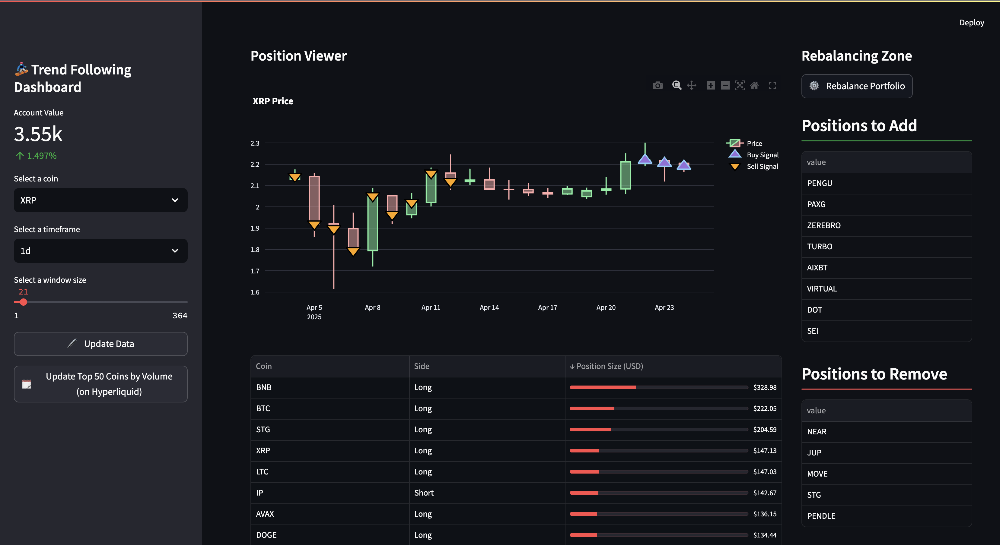

# Trend Following Dashboard

A real-time, automated trend-following dashboard for Hyperliquid perps built with Python.

## Preview

### Dashboard Screenshot


### Strategy Demo
[Watch the demo!](https://youtu.be/R-r0mxRnm9A)

## Strategy Overview

This system uses a simple 5 day breakout signal of a 20 day high/low to take a position long/short. We use inverse volatility weighting

**Goal:** Capture trending moves while managing downside using volatility-based sizing and market regime filters.

---

## Dashboard Features

Built with **Streamlit**, the dashboard shows:

- Current open positions
- Automated rebalancing
- Portfolio P&L tracking
- Volatility-adjusted sizing logic
- Chart showing historic buy and sell signals


All data pulled via the **Hyperliquid API**. Designed for **daily rebalancing**.

---

## Stack

- `Python` — strategy logic + API integration
- `Streamlit` — dashboard UI
- `Pandas/Numpy` — data processing
- `Hyperliquid API` — price + funding data

---

## Prerequisites

Make sure you have:

- Python 3.9+ installed
- [pip](https://pip.pypa.io/en/stable/) for package management
- (Optional) A virtual environment set up
- A `.env` file with your API credentials:
  ```env
  INFO_KEY=your_hyperliquid_api_key


## Full Setup
### 1. Clone the repo
```
git clone https://github.com/yourusername/trend-dashboard.git
cd trend-dashboard
```
### 2. [Create a Hyperliquid trading API key](https://app.hyperliquid.xyz/API)

### 3. (Optional) Create a virtual environment
```
python3 -m venv venv
source venv/bin/activate  # Windows: venv\Scripts\activate
```

### 4. Install dependencies
```
pip install -r requirements.txt
```

### 5. Create a .env file and add API Key
Create a .env file in the root folder with your credentials as such
```
API_PRIVATE_KEY=your_api_private_key
WALLET_ADDRESS=your_wallet_address
```

### 6. Finally just run this commmand at the root of your project
```
streamlit run dashboard.py
```
